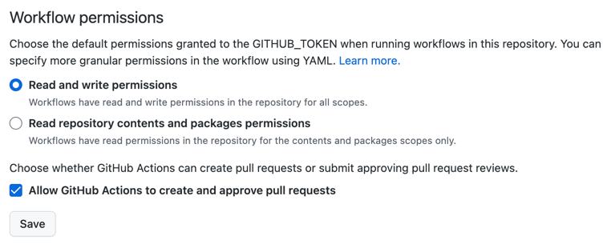

# Publish to NPM

`@ofadiman/publish-to-npm` is built for educational purposes and is intended to be used as a learning resource.

## Workflow to publish changes

1. Add new functionality to the project (e.g. new function).
2. Run the `pnpm changeset` command and fill in the questions according to the changes made.
3. Review generated changeset file in `.changeset` directory.
4. Commit all files.
5. Push changes to a new branch and open a pull request.
6. Merge pull request to the `main` branch.

# Permission issues

`changesets/action@v1` requires specific permissions to make changes in repository.

